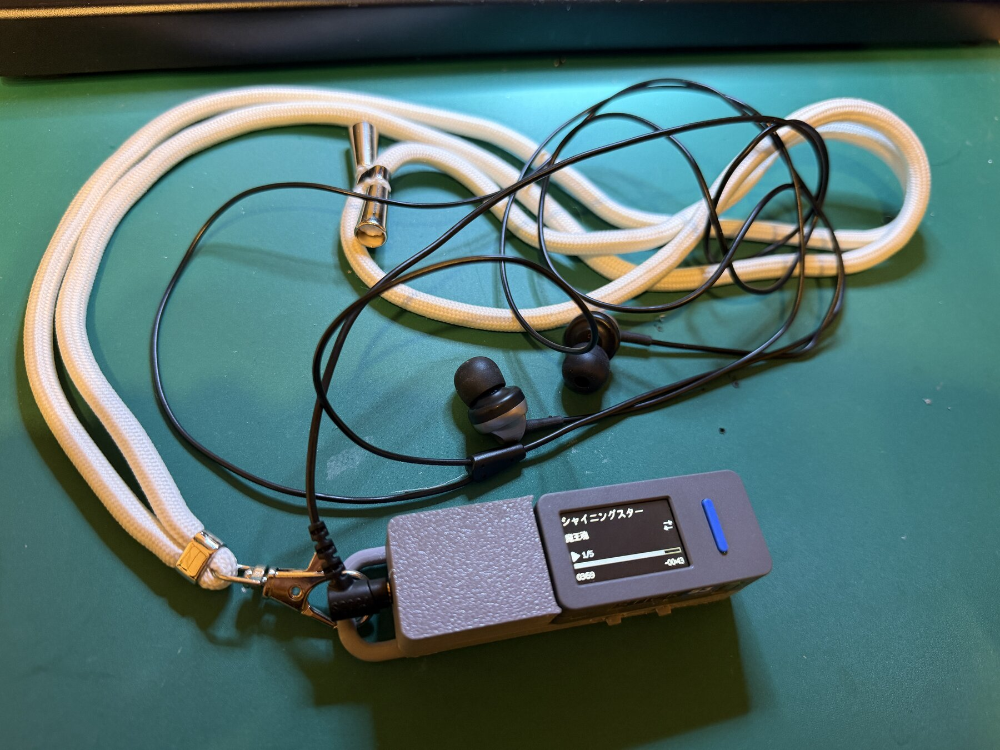
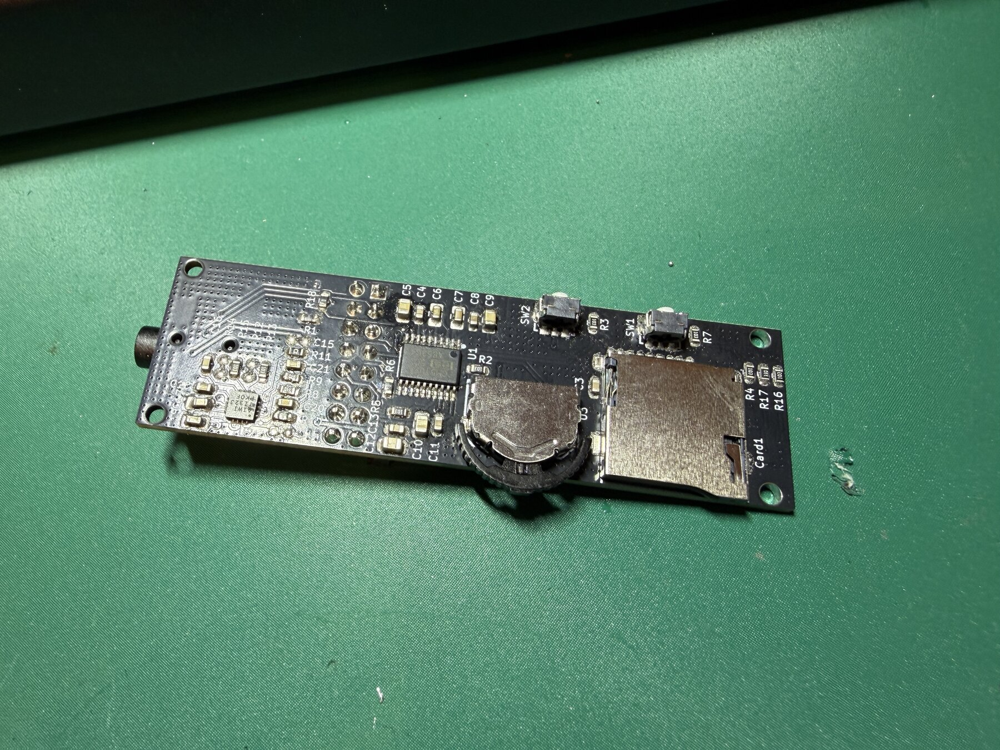
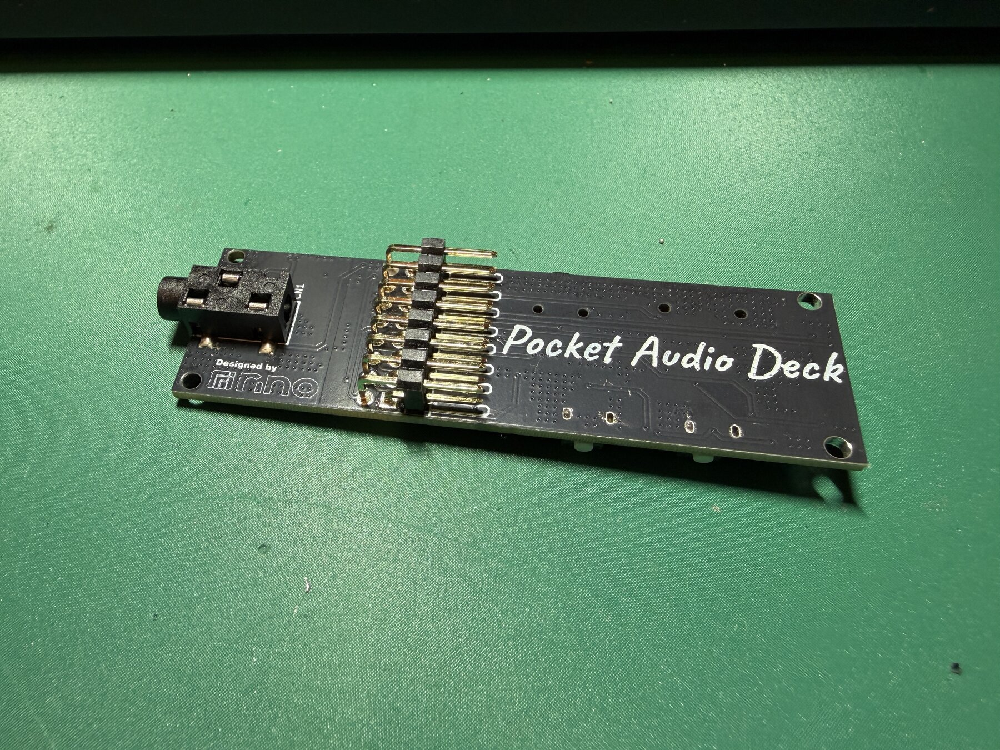
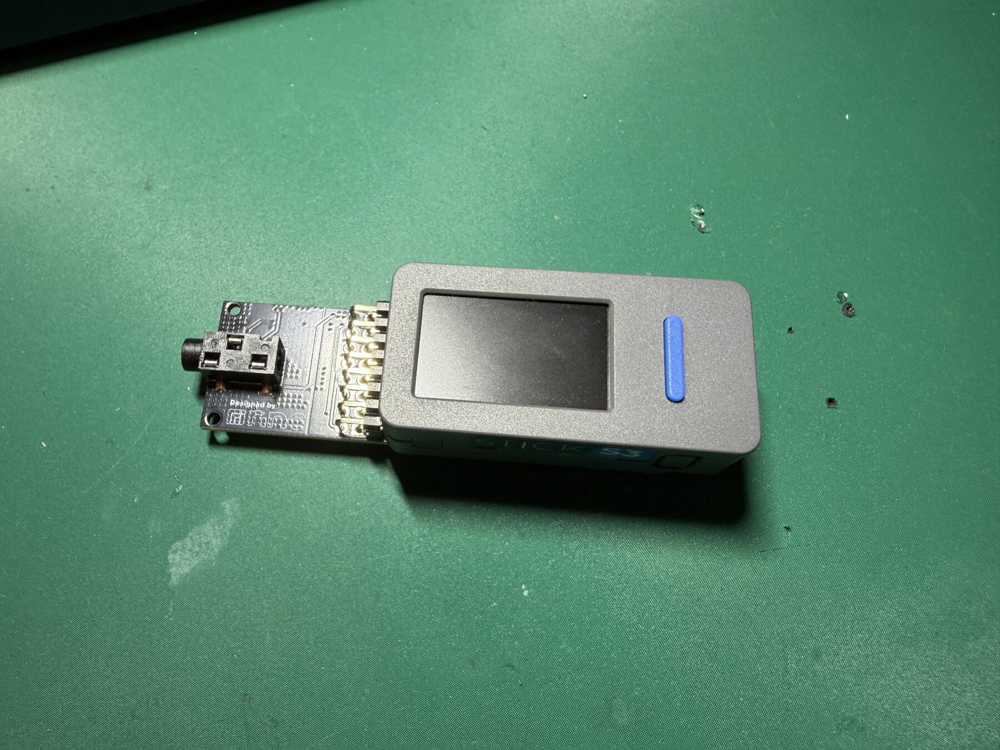
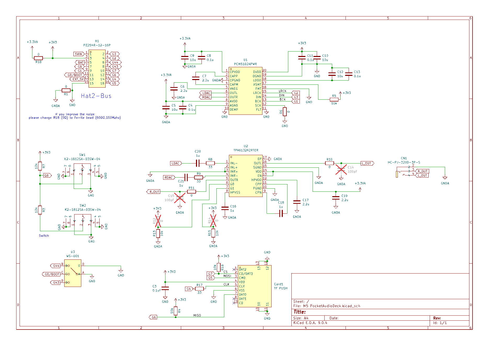
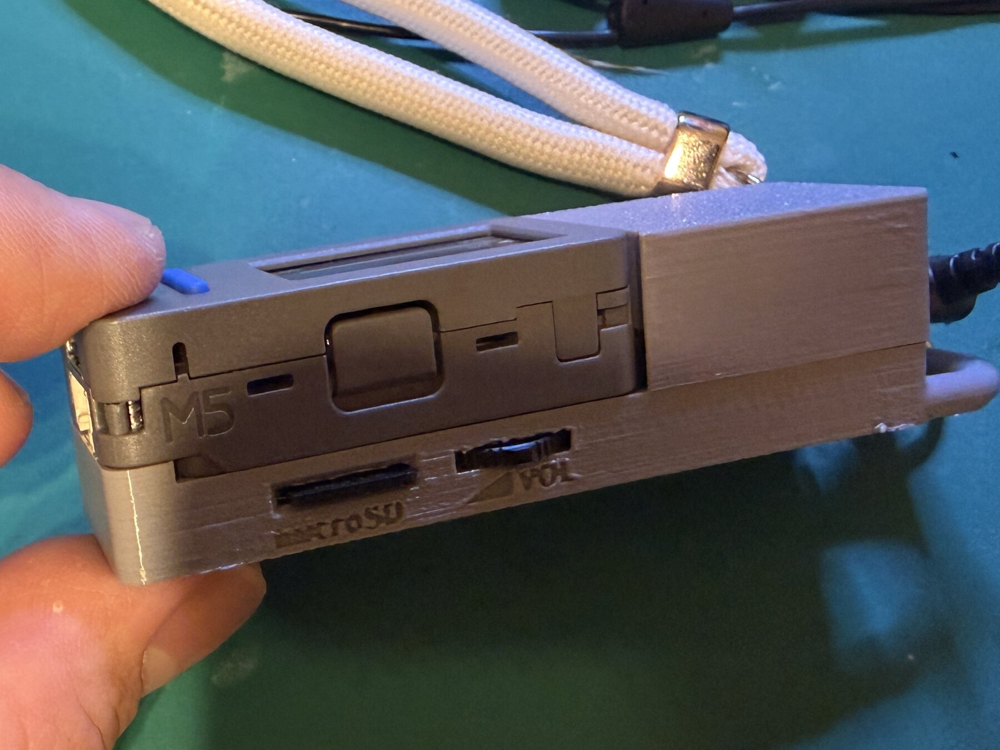
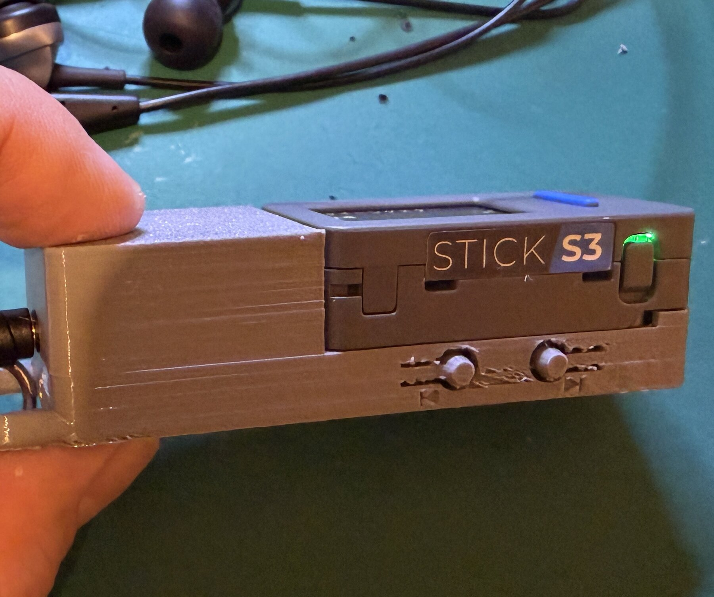
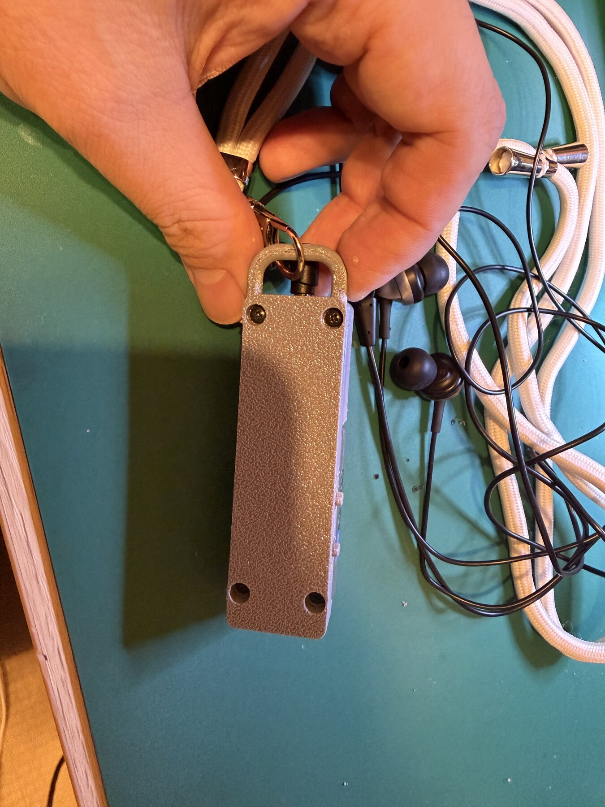

# Pocket Audio Deck: Web Radio and MP3 Player for M5StickS3

## Hackster project fields

**Title:** Pocket Audio Deck: Web Radio and MP3 Player for M5StickS3

**Elevator pitch:** An M5StickS3 pocket player with a custom headphone board, microSD MP3, Web Radio, FFT visuals, and a 3D-printed enclosure.

**Difficulty:** Intermediate

**Estimated build time:** 2 days after the PCB and enclosure parts are ready

**Repository:** https://github.com/norippy-i/PocketAudioDeck-WebRadio

**Tags:** M5Stack, M5StickS3, ESP32-S3, Web Radio, MP3 Player, I2S, PCM5102A, microSD, PlatformIO, Arduino, 3D Printing

## Story

### Why I built it

When I first looked at the M5StickS3 specifications, I immediately thought of the dedicated MP3 players I used about 20 years ago. Its compact body already contained a display, physical buttons, Wi-Fi, an ESP32-S3, and enough flash and PSRAM for audio decoding and a responsive interface. It felt like the right foundation for rebuilding that familiar kind of pocket player with modern network features. The idea sounded both nostalgic and genuinely fun to make.

I wanted the result to behave like a dedicated device, not a smartphone accessory or a development board with wires attached. It should start quickly, work through physical controls, show the important information at a glance, play through wired headphones, and switch between live Internet radio and MP3 files on a microSD card.

The result is Pocket Audio Deck: a custom expansion board, a two-part 3D-printed enclosure, and Arduino firmware that turns the M5StickS3 into a Web Radio and microSD MP3 player.



### From the first prototype to a dedicated audio board

The first prototype played network audio through the M5StickS3's built-in audio hardware. That was useful for proving the streaming and UI concepts, but a pocket player also needs wired headphone output, removable storage, and controls that can be operated without navigating menus.

I designed a dedicated Pocket Audio Deck board in KiCad. The board connects to the M5StickS3 expansion pins and adds:

- A PCM5102A stereo I2S DAC
- A TPA6132A2 stereo headphone amplifier
- A 3.5 mm headphone jack
- A microSD card socket
- Two previous/next switches
- A left/right/push control for volume and mute

The M5StickS3 remains the controller. It handles Wi-Fi, network protocols, MP3 decoding, metadata, FFT processing, the display, button logic, persistent settings, and mode switching. The custom board handles audio conversion, headphone drive, storage, and ergonomic controls.





### Hardware architecture

The architecture deliberately separates control and decoding from the analog audio path:

| Stage | Main component | Responsibility | Data or signal path |
|---|---|---|---|
| Audio source | Wi-Fi or microSD | Receive an HTTP MP3 stream or read a local MP3 file | Network stream or SPI storage |
| Control and decoding | M5StickS3 / ESP32-S3 | Decode MP3, process metadata and controls, generate the UI, and produce PCM samples | ESP32-audioI2S |
| Digital audio transfer | M5StickS3 to custom PCB | Carry decoded stereo PCM without an intermediate analog connection | I2S BCLK, LRCK, and DATA |
| Digital-to-analog conversion | PCM5102A | Convert stereo I2S PCM into left and right analog audio | Line-level stereo |
| Headphone drive | TPA6132A2 | Drive wired earphones at the selected volume | Amplified stereo |
| User output | 3.5 mm headphone jack | Provide the final listening connection | Wired headphones |

The main connections are:

| Function | M5StickS3 GPIO |
|---|---:|
| I2S BCLK | GPIO1 |
| I2S LRCK | GPIO2 |
| I2S DATA | GPIO3 |
| microSD SCLK | GPIO4 |
| microSD MOSI | GPIO5 |
| microSD MISO | GPIO6 |
| microSD CS | GPIO7 |
| Previous/next ADC input | GPIO8 |
| Volume down | GPIO43 |
| Volume up | GPIO44 |
| Mute push | GPIO0 |

The complete schematic is included in the GitHub repository. The PCB uses separate digital and analog supply domains around the DAC and headphone amplifier. R18 is a 0-ohm link in the current design; it can be replaced by a ferrite bead around 600 ohms at 100 MHz if additional supply-noise suppression is needed.





### Enclosure

Because the original idea was to recreate the directness of an older dedicated MP3 player, I deliberately kept the enclosure simple. The M5StickS3 and the custom PCB fit tightly into one continuous package instead of looking like two development boards joined together.

The side layout follows the familiar arrangement of portable audio players. The volume control and microSD slot can be reached without turning the device into a menu-driven gadget, while the previous and next tact switches are positioned for quick operation. I also designed small 3D-printed button caps around the switches so they are easier to find and press while still being printable as part of a compact enclosure.





The upper and base parts are provided as STEP files. They capture the M5StickS3 closely and protect the exposed electronics. The enclosure is secured from the rear using M2 x 6 mm self-tapping screws at the headphone-jack and USB-connector sides. This prevents it from coming apart during everyday carrying while still allowing deliberate disassembly for maintenance.

Finally, I added an integrated strap loop. It is a small detail, but it changes the project from something that lives on a workbench into something that can actually be carried like the pocket audio players that inspired it.



## Firmware

The firmware uses PlatformIO with the Arduino framework, M5Unified, and schreibfaul1's ESP32-audioI2S library. It targets the M5StickS3's 8 MB flash and PSRAM.

### Web Radio mode

The public firmware includes four listener-supported SomaFM stations using direct HTTP MP3 streams:

- Groove Salad
- Drone Zone
- Indie Pop Rocks!
- Space Station Soma

The player reads ICY stream metadata and displays the current track title. Long titles remain on one line and scroll only when they do not fit on the screen.

No Wi-Fi credentials are compiled into the public repository. Holding KEY1 in Radio mode starts a temporary access point and displays a QR code. A phone can scan the code, join `PocketAudioDeck-Setup`, and open the captive portal to enter the target SSID and password. The credentials are stored in ESP32 NVS.

### MP3 mode

MP3 mode scans the microSD card and starts playback when a card is available. It supports:

- ID3 title and artist metadata
- Track progress and remaining time
- Play/pause
- Previous and next track
- Repeat one
- Repeat all
- Shuffle
- Automatic card insertion and removal detection

Wi-Fi is explicitly disabled in MP3 mode. This reduces unnecessary RF activity and helps keep the player focused on local playback.

### Display and interaction

The interface is inspired by compact MP3 players rather than a general-purpose touchscreen UI. The small display has to communicate a surprising amount of information without becoming crowded, so every area and temporary overlay has a specific role.

| Display or interaction feature | Implementation | Why it matters in daily use |
|---|---|---|
| Station, artist, program, and track text | Large primary metadata area with single-line scrolling only when text does not fit | Keeps the most useful information readable without permanent truncation |
| 16-band spectrum analyzer | Real FFT calculated from decoded PCM samples | Reacts to the actual audio instead of displaying decorative random bars |
| Audio and visual synchronization | Approximately 180 ms of spectrum history | Makes the display motion align more naturally with sound from the headphones |
| Grayscale spectrum | Reduced-contrast bars below the metadata | Preserves the monochrome MP3-player character without overpowering the text |
| Tuning and buffering feedback | Large centered messages temporarily reuse the inactive spectrum area | Communicates state without covering station or program information |
| Volume feedback | Temporary full-width `VOL.xx` overlay | Gives immediate confirmation while leaving metadata space free during playback |
| MP3 progress | Progress bar, elapsed/remaining time, title, artist, and repeat/shuffle icon | Provides the information expected from a dedicated music player |
| Low-flicker drawing | M5Unified sprites and localized redraws | Prevents full-screen flashing when metadata, volume, or repeat mode changes |
| Persistent behavior | NVS stores the last mode, station, volume, EQ, and MP3 preferences | Restarts in the state the listener was actually using; mute is intentionally not restored |

Together, these details make Pocket Audio Deck behave much closer to a finished consumer MP3 player than a typical embedded audio demo. It remembers how it was used, handles removable media, exposes familiar playback modes, displays real metadata and remaining time, responds immediately to physical controls, and keeps the interface stable while audio continues in the background.

> **PHOTO 4 - REQUIRED:** Radio mode showing a station, current title, and active spectrum analyzer.

> **PHOTO 5 - RECOMMENDED:** MP3 mode showing ID3 information, progress, remaining time, and repeat/shuffle icon.

## Controls

| Control | Radio mode | MP3 mode |
|---|---|---|
| SW1 | Next station | Next track |
| SW2 | Previous station | Previous track |
| Left/right control | Volume down/up | Volume down/up |
| Control push | Toggle mute | Toggle mute |
| KEY1 click | - | Play/pause |
| KEY1 hold | Wi-Fi setup portal | Progress/spectrum view |
| KEY2 click | - | Change repeat mode |
| KEY2 hold | Switch to MP3 mode | Switch to Radio mode |
| KEY1 + KEY2 | Change EQ preset | Change EQ preset |

## Bill of materials

| Quantity | Component | Notes |
|---:|---|---|
| 1 | M5StickS3 | Main controller, display, Wi-Fi, ESP32-S3, and PSRAM |
| 1 | Pocket Audio Deck custom PCB | Fabricated from the KiCad design |
| 1 | PCM5102APWR | Stereo I2S DAC |
| 1 | TPA6132A2RTER | Stereo headphone amplifier |
| 1 | HC-PJ-320D-3P-S | 3.5 mm headphone jack |
| 1 | TF PUSH microSD socket | SPI storage |
| 2 | K2-1812SA-D3SW-04 | Previous/next switches |
| 1 | WS-001 control switch | Left/right volume and push mute |
| 1 | PZ254R-12-16P connector | M5StickS3 expansion connection |
| 1 | microSD card | FAT-formatted; stores MP3 files |
| 1 set | Resistors and capacitors | Values are listed in the schematic |
| 1 | 3D-printed upper enclosure | STEP file included |
| 1 | 3D-printed base enclosure | STEP file included |
| 2 | M2 x 6 mm self-tapping screws | Headphone-jack side and USB-connector side |
| 1 | Wired headphones | 3.5 mm stereo plug |

## Build instructions

### 1. Build the custom board

Fabricate and assemble the PCB using the supplied schematic. Pay particular attention to the analog power decoupling around the PCM5102A and TPA6132A2, and keep the I2S and analog output paths short and clean.

Before connecting headphones, inspect for shorts between 3.3 V, 3.3 VA, and ground. Verify the orientation of the DAC, amplifier, microSD socket, and board connector.

### 2. Print and assemble the enclosure

Print the upper and base models from the STEP files. Install the M5StickS3 and Pocket Audio Deck board, align the headphone jack and USB opening, and fasten both ends using M2 x 6 mm self-tapping screws.

### 3. Prepare the microSD card

Format a microSD card as FAT and copy MP3 files to it. The player scans the card and uses ID3 tags when they are available. If a file has no title tag, the filename is used.

### 4. Build the firmware

Clone the public repository and run:

```sh
./scripts/pio-local.sh run
```

Upload while the M5StickS3 is connected by USB:

```sh
./scripts/pio-local.sh run -t upload --upload-port /dev/cu.usbmodemXXXX
```

The pre-build script applies small hooks to ESP32-audioI2S so the firmware can receive decoded PCM samples for the spectrum analyzer and safely handle SD-card removal.

### 5. Configure Wi-Fi

1. Start in Radio mode.
2. Hold KEY1 until the QR code appears.
3. Scan the QR code with a phone.
4. Enter the target Wi-Fi SSID and password in the captive portal.
5. Save the settings and return to Radio mode.

### 6. Test both modes

Confirm that Radio mode connects, displays `PLAYING`, shows ICY metadata, and produces audio. Insert a microSD card, hold KEY2 to enter MP3 mode, and verify metadata, play/pause, next/previous, volume, mute, repeat, shuffle, and card hot-plug behavior.

## Development lessons

This project grew through repeated real-device testing. Several details only became clear after using it as a physical player:

- A dedicated headphone DAC and amplifier made more sense than relying on the internal speaker for the final product.
- A real FFT must use decoded PCM samples; visually plausible random bars were not enough.
- The spectrum display felt early until its history buffer was aligned with the actual audio output path.
- Updating only small sprite regions eliminated distracting display flicker.
- Wi-Fi should be disabled in MP3 mode to reduce unnecessary activity.
- SD-card removal needs explicit file-handle cleanup before unmounting.
- USB and Wi-Fi noise can couple into analog audio, so power-domain layout and optional ferrite filtering matter.
- Persistent station, mode, volume, and EQ settings make the device feel like a finished player rather than a demo.

## What makes it special

Pocket Audio Deck is not just a Web Radio sketch. It combines an M5Stack controller, a purpose-built audio PCB, physical controls, removable storage, a responsive low-flicker interface, real PCM-based visualization, persistent settings, and a printable enclosure into one reproducible pocket device.

The public firmware intentionally uses direct HTTP MP3 radio streams that other makers can test without regional authentication. The source code, schematic PDF, and enclosure STEP files are all available in the GitHub repository.

### A private Radiko version for Japan

I also developed and hardware-tested a private version that can play Radiko, a Japanese service for listening to live radio and podcasts. This mode can show the current station and program information and uses the same physical controls, headphone output, and spectrum interface as the public Web Radio edition.

The Radiko implementation is demonstrated in the project video, but its service-specific authentication and streaming code is intentionally not included in the public repository. The reproducible public build therefore uses open HTTP MP3 radio streams, while the private version shows that the same Pocket Audio Deck hardware can also serve as a practical Japanese radio receiver.

## Result

The finished device boots into the last-used mode, remembers the last station and listening volume, plays live Web Radio or local MP3 files, and can be controlled without taking out a phone. It captures the direct, tactile feeling of a dedicated MP3 player while using the M5StickS3 as a modern networked audio controller.

> **VIDEO - STRONGLY RECOMMENDED:** A 45-90 second horizontal demo showing boot, Web Radio metadata and spectrum, station switching, volume/mute, MP3 mode, play/pause, and SD-card insertion/removal.

## Resources

- Public firmware and hardware files: https://github.com/norippy-i/PocketAudioDeck-WebRadio
- M5Stack Global Innovation Contest 2026: https://m5stack.com/global-innovation-contest-2026
- SomaFM listen page: https://somafm.com/listen/
